# InsureFlow — Insurance Data Platform

InsureFlow is a portfolio-grade, end-to-end **Data Engineering** project simulating a Malaysian health-insurance data platform. It combines public Malaysian healthcare data with realistic synthetic insurance transactions, processing them through a medallion pipeline into a PostgreSQL warehouse and Power BI analytics dashboard.

> **Current Phase: Phase 1 — Project Foundation**  
> Status: Core repository foundation, PostgreSQL relational schema container, and deterministic synthetic customer generation are implemented. All pipeline stages and future datasets are planned.

---

## Target Architecture

```mermaid
flowchart LR
    subgraph S1[Data Sources]
        direction TB
        G1["Synthetic Customers [Implemented in Phase 1]"]
        G2["Synthetic Policies/Claims/Payments [Planned]"]
        D1["data.gov.my Healthcare Data [Planned]"]
        D2["MOH Facility Data [Planned]"]
    end

    subgraph S2[Pipeline & Warehouse]
        direction TB
        ING["Ingestion [Planned]"]
        BRZ["Bronze Layer [Planned]"]
        SLV["Silver Layer & Data Quality [Planned]"]
        GLD["Gold Dimensional Model [Planned]"]
        PG[("PostgreSQL Warehouse [Container & Base Schema Implemented]")]
    end

    subgraph S3[Analytics]
        PBI["Power BI Dashboards [Planned]"]
    end

    S1 --> ING --> BRZ --> SLV --> GLD --> PG --> PBI
```



### Stage Status Overview

| Stage | Description | Status |
|---|---|---|
| **Data Sources** | Synthetic customer generator (1,000 records) | **Implemented (Phase 1)** |
| **Data Sources** | Synthetic policies, claims, payments; MOH & data.gov.my datasets | **Planned** (Phase 2) |
| **Ingestion & Bronze** | Raw data ingestion with audit metadata | **Planned** (Phase 3) |
| **Silver & DQ** | Cleansing, conforming, quality rules, quarantine | **Planned** (Phase 4) |
| **Gold & Warehouse** | Dimensional star schema serving | **Planned** (Phase 5) |
| **Database Container** | PostgreSQL 16 via Docker Compose with base relational schema | **Implemented (Phase 1)** |
| **Analytics** | Power BI reports and executive metrics | **Planned** (Phase 6) |
| **Orchestration & Transformation** | dbt models and Airflow DAGs | **Planned** (Phase 7) |

---

## Phase 1 Stack

- **Language & Runtime:** Python 3.12+
- **Environment & Dependency Management:** Standard `venv`, `requirements.txt`
- **Data Generation:** `pandas`, `Faker` (with curated Malaysian names & occupations)
- **Database:** PostgreSQL 16 (Docker Compose)
- **Database Driver:** `psycopg2-binary`
- **Configuration:** `python-dotenv` with `.env` (git-ignored) and `.env.example`
- **Testing:** `pytest`
- **Version Control:** Git

---

## Current Dataset (Phase 1)

- **File:** `data/raw/customers.csv`
- **Records:** Exactly 1,000 synthetic Malaysian customers
- **Schema:**
  - `customer_id`: Unique, sequential (`C000001` .. `C001000`)
  - `first_name`, `last_name`: Curated Malaysian distributions (~60% Malay, ~28% Chinese, ~12% Indian)
  - `gender`: `Male` or `Female`
  - `date_of_birth`: Age 18–65 at reference date `2026-01-01`
  - `state`: 13 Malaysian states + 3 Federal Territories (Kuala Lumpur, Putrajaya, Labuan)
  - `occupation`: 30 curated realistic Malaysian professions
  - `created_at`: Seed-derived deterministic timestamp
- **Determinism:** Fixed seed ensures 100% byte-identical output across runs.

### Planned Future Data Sources

1. **data.gov.my Healthcare Datasets:** Public health indicators and demographic metrics.
2. **MOH Healthcare Facilities:** Official Malaysian Ministry of Health facility master registry.
3. **Synthetic Insurance Transactions:** Relational generators for `policies`, `claims`, and `payments`.

---

## Repository Structure

```
.
├── .env.example              # Template configuration with placeholder values
├── .gitattributes            # Enforces LF line endings
├── .gitignore                # Protects secrets, caches, and large data
├── docker-compose.yml        # PostgreSQL 16 service definition
├── requirements.txt          # Pinned production dependencies
├── requirements-dev.txt      # Pinned development dependencies (pytest)
├── pytest.ini                # Pytest configuration
├── README.md
├── AGENTS.md                 # Agent engineering rules & standards
├── CLAUDE.md                 # Agent guidance
├── data/
│   ├── raw/                  # customers.csv (tracked)
│   ├── processed/            # [Planned] Future pipeline outputs
│   └── sample/               # [Planned] Small samples
├── docs/
│   ├── PRD.md                # Product Requirements Document
│   └── architecture/         # System architecture and ADRs
├── notebooks/                # [Planned] Exploratory notebooks
├── sql/
│   └── init.sql              # Base schema DDL (customers, policies, claims, payments)
├── src/
│   ├── generation/           # Synthetic customer generator
│   ├── ingestion/            # [Planned] Phase 3
│   ├── transformation/       # [Planned] Phase 4
│   └── quality/              # [Planned] Phase 4
└── tests/
    └── test_generate_customers.py # Automated checks (uniqueness, counts, determinism)
```

---

## Quickstart Guide

### 1. Python Environment Setup

**Windows PowerShell:**
```powershell
python -m venv .venv
.\.venv\Scripts\Activate.ps1
pip install -r requirements.txt -r requirements-dev.txt
```

**macOS / Linux:**
```bash
python3 -m venv .venv
source .venv/bin/activate
pip install -r requirements.txt -r requirements-dev.txt
```

### 2. Configure Environment

Copy `.env.example` to `.env` and set your local development password:
```powershell
Copy-Item .env.example .env
```
*(Default host port is set to `5433` to prevent conflicts with local instances on `5432`)*.

### 3. Start Database Container

```bash
docker compose up -d
docker compose ps
```

Verify tables are initialized:
```powershell
docker compose exec postgres psql -U insureflow_user -d insureflow -c "\dt"
```

### 4. Generate Synthetic Customers

```powershell
python src/generation/generate_customers.py
```

### 5. Run Test Suite

```powershell
pytest -v
```

### 6. Reset Database from Scratch (Destructive)

```bash
docker compose down -v && docker compose up -d
```
