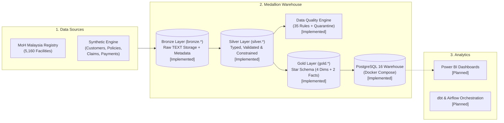

# InsureFlow — Insurance Data Platform

InsureFlow is an end-to-end **Data Engineering** platform simulating a Malaysian health insurance provider. It combines public healthcare data from the Malaysian Ministry of Health with realistic synthetic insurance transactions, processing them through a medallion architecture (Bronze → Silver → Gold) into a PostgreSQL analytical warehouse ready for Power BI reporting.

Instead of a standalone script or notebook, InsureFlow demonstrates production data engineering fundamentals: layered schema isolation, idempotent loads, schema enforcement, automated data quality with quarantine tables, and star schema dimensional modeling.

---

## Highlights

- **Medallion Warehouse in PostgreSQL:** Strict layer separation using dedicated database schemas (`bronze`, `silver`, `gold`). The default `public` schema is retired.
- **35 Data Quality Rules with 100% Recall:** Automated DQ engine checks completeness, uniqueness, validity, and consistency across 4 tables. Tested against 188 injected defects with 100% recall, isolating bad records into quarantine files and achieving 0 failures on clean source data.
- **Financial Precision Traced End-to-End:** All monetary metrics use `NUMERIC(12,2)` throughout. The recomputed portfolio loss ratio in Gold matches the clean Silver data to 4 decimal places (**74.2766%**, calibrated against the ~74.3% actuarial target).
- **Authentic Geographic Grounding:** Integrates **5,160 public healthcare facilities** from the official Ministry of Health Malaysia (KKM) registry across all 13 states and 3 federal territories, linking customer home states to local treatment facilities.
- **Deterministic & Reproducible Data Generation:** Generates 1,000 customers, 1,379 policies, 423 claims, and 364 payments using fixed seeds and an anchored reference date (`2026-01-01`), guaranteeing byte-identical CSVs without wall-clock drift.
- **110 Automated Tests:** Comprehensive test suite in `pytest` covering data generation determinism, COPY ingestion, type coercion, reject routing, rule enforcement, defect recall, age derivation, and date dimension continuity.
- **Atomic, Idempotent Pipeline Loads:** Idempotent bulk COPY ingestion (with SHA-256 skip checks) and transactional full-refreshes guarantee identical row counts on repeated runs.

---

## Architecture

InsureFlow processes data sequentially through three medallion stages inside PostgreSQL:



*For a detailed left-to-right flowchart suitable for presentation, see [docs/architecture/pipeline-diagram.md](docs/architecture/pipeline-diagram.md).*

### Medallion Layer Specifications

| Layer | Schema | Granularity & Description | Tech / Artifact | Status |
|---|---|---|---|---|
| **Raw Sources** | `data/raw/` | 5 CSV datasets: 1,000 customers, 1,379 policies, 423 claims, 364 payments, 5,160 facilities | Python generators, KKM open data | **[Implemented]** |
| **Bronze** | `bronze.*` | Append-only raw storage with all business columns as `TEXT`. Includes `_batch_id`, `_source_file`, `_ingested_at`, and an audit log table (`bronze.ingestion_log`) | PostgreSQL COPY, SHA-256 validation | **[Implemented]** |
| **Silver** | `silver.*` | Strongly typed (`DATE`, `NUMERIC(12,2)`), relational integrity enforced via Python before load, corrupt rows routed to `silver.rejected_rows` | Full refresh, Python transform | **[Implemented]** |
| **Data Quality** | `data/sample/` | 35 rules covering completeness, uniqueness, validity, consistency. Quarantines defective rows into CSVs and generates Markdown/CSV reports | Python DQ runner, defect manifest | **[Implemented]** |
| **Gold** | `gold.*` | Dimensional star schema: `dim_date`, `dim_customer`, `dim_policy`, `dim_facility`, `fact_claims`, `fact_payments`. Natural PKs with `ON DELETE RESTRICT` FKs | Full refresh, single transaction | **[Implemented]** |
| **Analytics** | — | Interactive Power BI dashboard covering loss ratios, claims turnaround, and facility geospatial mapping | Power BI | **[Planned]** |

---

## Datasets

All temporal attributes are anchored to the fixed reference date **`2026-01-01`** to prevent wall-clock drift:

| Entity / File | Source | Records | Size | Description |
|---|---|---:|---:|---|
| `data/raw/customers.csv` | Synthetic | 1,000 | ~89 KB | Demographics across 16 states/territories, aged 18–65 |
| `data/raw/policies.csv` | Synthetic | 1,379 | ~135 KB | 1-year policies (Medical, Hospitalization, Critical Illness, PA) |
| `data/raw/claims.csv` | Synthetic | 423 | ~45 KB | Claims with treatment dates, facility IDs, and adjudication statuses |
| `data/raw/payments.csv` | Synthetic | 364 | ~32 KB | Claim payouts with payment methods and settlement dates |
| `data/raw/facilities_master.csv` | MoH Malaysia | 5,160 | ~956 KB | Public hospital and clinic master registry (`KOD_FASILITI` PK) |

---

## How to Run This (End-to-End)

All commands are runnable from the repository root using Windows PowerShell.

### 1. Prerequisites & Environment Setup

```powershell
# Clone the repository and navigate into the project
cd C:\Users\User\Projects\insureflow-data-platform

# Create and activate virtual environment (Python 3.12+)
python -m venv .venv
.\.venv\Scripts\Activate.ps1

# Install production and development dependencies
pip install -r requirements.txt -r requirements-dev.txt

# Configure environment variables (default host port is 5433)
Copy-Item .env.example .env
```

### 2. Start PostgreSQL Warehouse Container

```powershell
docker compose up -d
docker compose ps
```

### 3. Generate Data & Fetch Ministry of Health Registry

```powershell
# 1. Download official MOH facility registry
python src/ingestion/download_sources.py

# 2. Run deterministic synthetic generation pipeline
python -m src.generation.generate_all
```

### 4. Ingest Bronze Layer (Idempotent COPY)

```powershell
# Ingest all 5 raw source files into bronze.* schema
python src/ingestion/ingest_bronze.py
```

### 5. Transform to Silver Layer (Validation & Reject Routing)

```powershell
# Truncate and reload silver.*, capturing rejected rows in silver.rejected_rows
python src/transformation/transform_silver.py
```

### 6. Execute Data Quality Framework & Quarantine Evaluation

```powershell
# 1. Inject controlled defects (~1.5%) into sample copies to benchmark DQ detection
python src/quality/inject_defects.py

# 2. Run 35 DQ rules, quarantine failures, and compare against ground truth manifest
python src/quality/run_dq_checks.py

# 3. Verify clean baseline produces 0 failures
python src/quality/run_dq_checks.py --clean
```

### 7. Build Gold Dimensional Model (Star Schema)

```powershell
# Atomically load star schema in gold.* from clean silver.* data
python src/transformation/load_gold.py
```

### 8. Run Automated Tests

```powershell
# Run the complete test suite (110 tests across all layers)
pytest
```

---

## Repository Structure

```
insureflow-data-platform/
├── .env.example              # Template configuration with placeholder values
├── .gitattributes            # Enforces LF line endings
├── .gitignore                # Protects secrets, caches, and large data
├── docker-compose.yml        # PostgreSQL 16 service definition (port 5433:5432)
├── requirements.txt          # Pinned production dependencies (pandas, Faker, psycopg2-binary)
├── requirements-dev.txt      # Pinned development dependencies (pytest)
├── pytest.ini                # Pytest path and runner configuration
├── README.md                 # Project overview and run guide
├── AGENTS.md                 # Agent engineering rules & standards
├── CLAUDE.md                 # Project instructions and conventions
├── data/
│   ├── raw/                  # Clean tracked CSVs (customers, policies, claims, payments, facilities)
│   ├── processed/            # [Planned] Future pipeline outputs
│   └── sample/               # Phase 4B dirty, quarantine, passed, manifest, and DQ report files
├── docs/
│   ├── PRD.md                # Product Requirements Document
│   ├── data-sources.md       # Dataset profiles, catalogue & Phase 2A findings
│   ├── ADR-012.md            # ADR: Bronze layer ingestion and schema validation
│   ├── ADR-014.md            # ADR: Silver schema and public.* retirement
│   ├── ADR-015.md            # ADR: Data Quality rule framework & quarantine strategy
│   ├── ADR-016.md            # ADR: Gold dimensional model & natural keys
│   └── architecture/         # Architecture documentation and diagrams
│       ├── ARCHITECTURE.md
│       ├── ARCHITECTURE_ESSENTIAL.md
│       └── pipeline-diagram.md
├── notebooks/                # [Planned] Exploratory notebooks
├── scripts/
│   └── verify_db_rollback.py # Automated DB constraint & FK check with rollback
├── sql/
│   ├── init.sql              # Drops public schema (Phase 4A+)
│   ├── bronze.sql            # Bronze schema DDL (5 data tables + ingestion_log)
│   ├── silver.sql            # Silver schema DDL (5 typed tables + rejected_rows)
│   └── gold.sql              # Gold schema DDL (4 dims + 2 facts, star schema)
├── src/
│   ├── generation/           # Synthetic data generation suite
│   │   ├── common.py         # Shared seed handling, constants, CSV writer
│   │   ├── generate_customers.py
│   │   ├── generate_policies.py
│   │   ├── generate_claims.py
│   │   ├── generate_payments.py
│   │   └── generate_all.py   # Full generation pipeline runner
│   ├── ingestion/            # Source data acquisition & Bronze ingestion
│   │   ├── download_sources.py  # Idempotent downloader for MOH / data.gov.my
│   │   └── ingest_bronze.py     # Bronze COPY loader with audit log
│   ├── transformation/       # Transformation suite
│   │   ├── transform_silver.py  # Full-refresh Bronze → Silver with reject logging
│   │   └── load_gold.py         # Full-refresh Silver → Gold star schema load
│   └── quality/              # Data Quality suite
│       ├── inject_defects.py # Deterministic defect injector + manifest recorder
│       ├── dq_rules.py       # 35 composable rules (completeness, uniqueness, validity, consistency)
│       └── run_dq_checks.py  # Quarantine executor, DQ reporter, and recall evaluator
└── tests/
    ├── test_dq_rules.py            # 11 unit tests for individual DQ rules
    ├── test_generate_customers.py  # 10 tests for customer generator
    ├── test_generate_phase2b.py    # 37 tests (regression, FKs, distributions, amounts)
    ├── test_ingest_bronze.py       # 16 tests (unit + integration) for Bronze ingestion
    ├── test_inject_defects.py      # 3 tests for defect injector determinism and manifest
    ├── test_load_gold.py           # 17 tests (unit: age/date-dim; integration: counts, idempotency, gaps)
    ├── test_run_dq_checks.py       # 2 integration tests for DQ pipeline and clean baseline
    └── test_transform_silver.py    # 14 tests (unit + integration) for Silver transformation
```

---

## Known Limitations & Honest Caveats

1. **Public Healthcare Facilities vs. Private Insurance:**
   The facility registry consists of public Ministry of Health facilities (general hospitals, district hospitals, klinik kesihatan, klinik pergigian). In Malaysia, private insurance claims are overwhelmingly treated at private hospitals and panel clinics. Linking synthetic claims to public MoH facilities is a conscious modeling decision to provide authentic Malaysian GIS coordinates and administrative codes without relying on proprietary panel provider lists.
2. **Actuarial Assumptions:**
   Premiums, claim frequencies, and payout distributions are calibrated to reflect realistic Malaysian market dynamics (e.g. higher medical card claims vs. lower critical illness frequency; loss ratios ~74%), but are illustrative synthetic models rather than actual actuarial filings.
3. **Synthetic PII:**
   All personal information (names, national identification numbers, occupations, contact details) is strictly synthetic and generated from curated cultural dictionaries. No real personal data exists in the platform.
4. **Full-Refresh vs. Incremental Loading:**
   The Silver and Gold transformations currently run as full-refresh pipeline stages inside single transactions. While appropriate for this volume and batch cycle, enterprise streaming or intraday updates would utilize incremental CDC models (planned for future orchestration phases with dbt/Airflow).

---

## Further Documentation

- **[Product Requirements Document (PRD)](docs/PRD.md):** Project vision, phase boundaries, definition of done, and roadmap.
- **[Architecture Deep Dive](docs/architecture/ARCHITECTURE.md):** Comprehensive schema contracts, actuarial calibration formulas, and entity relationships.
- **[Architecture Quick Reference](docs/architecture/ARCHITECTURE_ESSENTIAL.md):** One-page cheatsheet for fast orientation.
- **[Pipeline Flowchart](docs/architecture/pipeline-diagram.md):** Clean presentation diagram of the end-to-end data pipeline.
- **Architectural Decision Records (ADRs):**
  - [ADR-012: Bronze Ingestion & Validation](docs/ADR-012.md)
  - [ADR-014: Silver Layer & Public Schema Retirement](docs/ADR-014.md)
  - [ADR-015: Data Quality Framework & Quarantine Strategy](docs/ADR-015.md)
  - [ADR-016: Gold Star Schema & Natural Key Strategy](docs/ADR-016.md)
