# InsureFlow — Insurance Data Platform

InsureFlow is a portfolio-grade, end-to-end **Data Engineering** project simulating a Malaysian health-insurance data platform. It combines public Malaysian healthcare data with realistic synthetic insurance transactions, processing them through a medallion pipeline into a PostgreSQL warehouse and Power BI analytics dashboard.

> **Current Phase: Phase 2B — Synthetic Policies, Claims, and Payments**  
> Status: Core repository foundation, PostgreSQL relational schema container (with `facilities`, `customers`, `policies`, `claims`, and `payments` tables), Ministry of Health Malaysia facility dataset acquisition (Phase 2A), and deterministic synthetic generators for all four transactional entities (Phase 2B) are implemented. All pipeline stages (Bronze/Silver/Gold) are planned for subsequent phases.

---

## Target Architecture

```mermaid
flowchart LR
    subgraph S1[Data Sources]
        direction TB
        G1["Synthetic Customers [Implemented - P1]"]
        G2["Synthetic Policies/Claims/Payments [Implemented - P2B]"]
        D1["MOH Facility Master Registry [Acquired - P2A]"]
        D2["data.gov.my Healthcare Data [Investigated - P2A]"]
    end

    subgraph S2[Pipeline & Warehouse]
        direction TB
        ING["Ingestion [Planned - P3]"]
        BRZ["Bronze Layer [Planned - P3]"]
        SLV["Silver Layer & Data Quality [Planned - P4]"]
        GLD["Gold Dimensional Model [Planned - P5]"]
        PG[("PostgreSQL Warehouse [Container & Base Schema Implemented]")]
    end

    subgraph S3[Analytics]
        PBI["Power BI Dashboards [Planned - P6]"]
    end

    S1 --> ING --> BRZ --> SLV --> GLD --> PG --> PBI
```



### Stage Status Overview

| Stage | Description | Status |
|---|---|---|
| **Data Sources** | Synthetic customer generator (1,000 records) | **Implemented (Phase 1)** |
| **Data Sources** | Ministry of Health facility master registry acquisition (5,160 facilities) | **Implemented (Phase 2A)** |
| **Data Sources** | Synthetic policies (1,379), claims (1,059), payments (814); FK to facilities | **Implemented (Phase 2B)** |
| **Ingestion & Bronze** | Raw data ingestion with audit metadata | **Planned** (Phase 3) |
| **Silver & DQ** | Cleansing, conforming, quality rules, quarantine | **Planned** (Phase 4) |
| **Gold & Warehouse** | Dimensional star schema serving | **Planned** (Phase 5) |
| **Database Container** | PostgreSQL 16 via Docker Compose with relational schema (`init.sql`) | **Implemented (Phase 1 & 2B)** |
| **Analytics** | Power BI reports and executive metrics | **Planned** (Phase 6) |
| **Orchestration & Transformation** | dbt models and Airflow DAGs | **Planned** (Phase 7) |

---

## Stack

- **Language & Runtime:** Python 3.12+
- **Environment & Dependency Management:** Standard `venv`, `requirements.txt`
- **Data Generation & Ingestion:** `pandas`, `Faker` (with curated Malaysian names & occupations), Python standard library (`urllib.request`, `hashlib`, `csv`)
- **Database:** PostgreSQL 16 (Docker Compose)
- **Database Driver:** `psycopg2-binary`
- **Configuration:** `python-dotenv` with `.env` (git-ignored) and `.env.example`
- **Testing:** `pytest` (37 automated unit, property, and regression tests)
- **Version Control:** Git

---

## Current Datasets (Phase 1 & Phase 2B)

| Entity / File | Source | Records | Size | Description |
|---|---|---:|---:|---|
| `data/raw/customers.csv` | Synthetic (P1) | 1,000 | ~89 KB | Base customers across 16 states/territories, aged 18–65 |
| `data/raw/policies.csv` | Synthetic (P2B) | 1,379 | ~128 KB | 1-year policies (MEDICAL, HOSPITALIZATION, CRITICAL_ILLNESS, PA) |
| `data/raw/claims.csv` | Synthetic (P2B) | 1,059 | ~109 KB | Claims linked to policies and MOH treatment facilities |
| `data/raw/payments.csv` | Synthetic (P2B) | 814 | ~69 KB | Payouts for APPROVED/PARTIALLY_APPROVED claims |
| `data/raw/facilities_master.csv` | MOH Malaysia (P2A) | 5,160 | ~956 KB | Public healthcare facilities registry (`KOD_FASILITI` PK) |

### Attribution & Data Source Notice

- **Public Healthcare Facility Data:** Sourced from the **Ministry of Health Malaysia (Kementerian Kesihatan Malaysia)** via official public data resources.
- **Known Limitation:** The acquired facility registry consists of public Ministry of Health facilities (general hospitals, district hospitals, klinik kesihatan, klinik pergigian). In the real Malaysian insurance market, private hospitals and panel clinics handle a significant portion of insured claims. Attributing synthetic insurance claims to public MoH facilities is a conscious modeling simplification for this portfolio project to leverage authentic Malaysian geospatial and facility identifiers without proprietary panel data.

---

## Repository Structure

```
.
├── .env.example              # Template configuration with placeholder values
├── .gitattributes            # Enforces LF line endings
├── .gitignore                # Protects secrets, caches, and large data
├── docker-compose.yml        # PostgreSQL 16 service definition
├── requirements.txt          # Pinned production dependencies
├── requirements-dev.txt      # Pinned development dependencies (pytest)
├── pytest.ini                # Pytest configuration
├── README.md
├── AGENTS.md                 # Agent engineering rules & standards
├── CLAUDE.md                 # Agent guidance
├── data/
│   ├── raw/                  # Tracked CSVs: customers, policies, claims, payments
│   ├── processed/            # [Planned] Future pipeline outputs
│   └── sample/               # [Planned] Small samples
├── docs/
│   ├── PRD.md                # Product Requirements Document
│   ├── data-sources.md       # Dataset profiles, catalogue & Phase 2A findings
│   └── architecture/         # System architecture, schemas, and ADRs
│       ├── ARCHITECTURE.md
│       └── ARCHITECTURE_ESSENTIAL.md
├── notebooks/                # [Planned] Exploratory notebooks
├── scripts/
│   └── verify_db_rollback.py # Automated DB constraint & FK check with rollback
├── sql/
│   └── init.sql              # Relational DDL (facilities, customers, policies, claims, payments)
├── src/
│   ├── generation/           # Synthetic data generation suite
│   │   ├── common.py         # Shared seed handling, constants, CSV writer
│   │   ├── generate_customers.py
│   │   ├── generate_policies.py
│   │   ├── generate_claims.py
│   │   ├── generate_payments.py
│   │   └── generate_all.py   # Full pipeline runner
│   ├── ingestion/            # Source data acquisition
│   │   └── download_sources.py # Idempotent downloader for MOH / data.gov.my
│   ├── transformation/       # [Planned] Phase 4
│   └── quality/              # [Planned] Phase 4
└── tests/
    ├── test_generate_customers.py # 10 tests for customer generator
    └── test_generate_phase2b.py   # 27 tests (regression, FKs, distributions, amounts)
```

---

## Quickstart Guide

### 1. Python Environment Setup

**Windows PowerShell:**
```powershell
python -m venv .venv
.\.venv\Scripts\Activate.ps1
pip install -r requirements.txt -r requirements-dev.txt
```

**macOS / Linux:**
```bash
python3 -m venv .venv
source .venv/bin/activate
pip install -r requirements.txt -r requirements-dev.txt
```

### 2. Configure Environment

Copy `.env.example` to `.env` and set your local development password:
```powershell
Copy-Item .env.example .env
```
*(Default host port is set to `5433` to prevent conflicts with local instances on `5432`)*.

### 3. Start Database Container

```bash
docker compose up -d
docker compose ps
```

Verify tables are initialized:
```powershell
docker compose exec postgres psql -U insureflow_user -d insureflow -c "\dt"
```

### 4. Fetch Facility Data & Generate Synthetic Datasets

```powershell
# 1. Download official MOH facility registry (Phase 2A)
python src/ingestion/download_sources.py

# 2. Run full generation pipeline (Phase 1 + 2B)
python -m src.generation.generate_all
```

### 5. Run Test Suite

```powershell
pytest -v
```

### 6. Verify Database Constraints (Non-destructive Check)

```powershell
python scripts/verify_db_rollback.py
```

### 7. Reset Database from Scratch (Destructive)

```powershell
docker compose down -v; docker compose up -d
```
