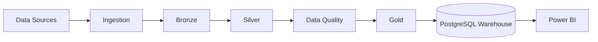
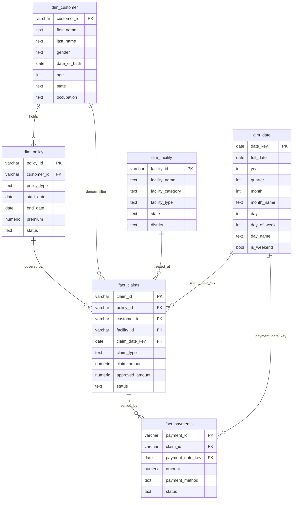
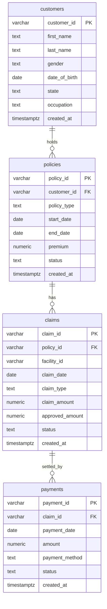

# InsureFlow — Architecture

| | |
|---|---|
| **Status** | Draft v0.1 |
| **Current phase** | Phase 5 — Gold Layer (Dimensional Model) |
| **Short version** | See [`ARCHITECTURE_ESSENTIAL.md`](./ARCHITECTURE_ESSENTIAL.md) |

**Status legend:** **[Implemented]** exists in the repo · **[Planned]** agreed direction, not built · **[Tentative]** idea, may change.

Anything not marked **[Implemented]** must not be described as done in the README or elsewhere.

---

## 1. Purpose

This document describes the target architecture of InsureFlow and how it is expected to evolve. It separates what exists today from what is planned, so agents and readers never confuse the two.

## 2. Target Architecture



| Stage | Purpose | Status |
|---|---|---|
| Data Sources | Synthetic generators, MOH facility registry | Implemented (Phase 1, 2A, 2B) |
| Ingestion | Load raw sources via psycopg2 COPY with audit logging | **[Implemented in Phase 3]** |
| Bronze | Raw, append-only tables in `bronze` schema with metadata | **[Implemented in Phase 3]** |
| Silver | Typed, constrained, validated; rejected rows quarantined in `silver.rejected_rows` | **[Implemented in Phase 4A]** |
| Data Quality | Rule framework, defect injection, quarantine, reporting | **[Implemented in Phase 4B]** |
| Gold | Business-ready dimensional model | **[Implemented in Phase 5]** |
| PostgreSQL Warehouse | Serves Gold to BI; hosts `bronze` and `silver` schemas | **[Implemented]** (Docker Compose) |
| Power BI | Dashboards | **[Planned]** |

Later additions: dbt, Airflow, MinIO (S3-compatible), incremental processing, monitoring, optional Azure/Databricks concepts **[Tentative]**.

## 3. Layer Definitions (contract for future phases)

### Bronze **[Implemented in Phase 3]**
- Stores data **as received** in dedicated `bronze` schema; all business columns are `TEXT`. No deduplication, no business cleaning, no type coercion.
- Metadata columns on every table: `_batch_id` (UUID), `_source_file` (TEXT), `_source_row_number` (INT), `_ingested_at` (TIMESTAMPTZ NOT NULL DEFAULT now()).
- Append-only; normal operations never UPDATE or DELETE rows in bronze.
- Audit logging via `bronze.ingestion_log` with SHA256 checksums, row counts, execution duration, and SUCCESS/FAILED status. Idempotent skip on unchanged files unless `--force` is passed.
- Pre-load CSV header schema validation: before loading, CSV header columns are compared against expected bronze table columns. Batches with missing or extra columns fail and roll back with a descriptive audit log entry; column order differences are allowed.

### Silver **[Implemented in Phase 4A]**
- Resides in dedicated `silver` schema (`sql/silver.sql`).
- Full refresh per run: TRUNCATE all silver tables + `silver.rejected_rows`, then reload inside a single transaction.
- Reads only the latest batch per source from Bronze (from `bronze.ingestion_log` or latest `_batch_id` as fallback).
- Type casting: TEXT → DATE, TEXT → NUMERIC(12,2) via Decimal, TEXT → TIMESTAMPTZ; enum values validated against CHECK constraint sets.
- Referential integrity enforced in Python before INSERT: policies referencing unknown customers, claims referencing unknown policies or facilities, and payments referencing unknown claims are routed to `silver.rejected_rows`.
- `silver.rejected_rows`: captures `source_table`, `source_batch_id`, `source_row_number`, `reject_reason` (text), `raw_row` (JSONB), `rejected_at`.
- Load order respects FKs: facilities & customers → policies → claims → payments.
- Aggregated DQ rule framework and reporting implemented in Phase 4B.

### Data Quality **[Implemented in Phase 4B]**
- Rule dimensions: completeness, uniqueness, validity (domain sets, ISO date formats, numeric bounds), consistency (future dates, customer age, `end_date >= start_date`, `approved_amount <= claim_amount`, cross-table policy periods and payment dates).
- Defect injection (`src/quality/inject_defects.py`): deterministic injection (~1.5% across 4 categories) into separate sample copies (`data/sample/*_dirty.csv`) without altering clean data; ground-truth manifest in `data/sample/defect_manifest.csv`.
- Quarantine-not-delete strategy: failing rows quarantined into `data/sample/<table>_quarantine.csv` with combined failure reasons; passing rows written to `data/sample/<table>_passed.csv`.
- Reporting & evaluation (`src/quality/run_dq_checks.py`): writes `data/sample/dq_report.csv` and `data/sample/dq_report.md` tracking rows checked, failed, and fail rate per rule, plus ground truth recall and false positive benchmarks against the manifest.
- Zero-failure clean baseline: running against `data/raw/` yields 0 failures across all rules.

### Gold **[Implemented in Phase 5]**

Star schema in `gold.*`. Natural keys from Silver used as PKs (see ADR-016).

| Table | Type | Grain |
|---|---|---|
| `gold.dim_date` | dimension | one row per calendar day; `date_key DATE PK` |
| `gold.dim_customer` | dimension | one row per customer; includes computed `age` |
| `gold.dim_policy` | dimension | one row per policy |
| `gold.dim_facility` | dimension | one row per healthcare facility |
| `gold.fact_claims` | fact | one row per claim; `customer_id` denormalized from policy |
| `gold.fact_payments` | fact | one row per payment |

DDL: `sql/gold.sql`. Load script: `src/transformation/load_gold.py` (full refresh, single transaction).



## 4. Technology Choices

| Concern | Choice | Why | Status |
|---|---|---|---|
| Language | Python 3.12+ | Standard for DE; matches skills being demonstrated | **[Implemented]** |
| Dependency management | `venv` + `requirements.txt` + `requirements-dev.txt` | Simple, universally understood; separates runtime from test/dev dependencies | **[Implemented]** |
| Test framework | `pytest` + `pytest.ini` | Automated property, count, and determinism verification | **[Implemented]** |
| Data manipulation | pandas | Sufficient at this scale | **[Implemented]** |
| Synthetic data | Faker (seeded) + curated lists | Reproducible; curated lists fix Faker's non-Malaysian defaults | **[Implemented]** |
| Config | `python-dotenv` + `.env` | Secrets stay out of code and Git | **[Implemented]** |
| DB driver | `psycopg2-binary` | Standard PostgreSQL driver | **[Implemented]** (dependency only in Phase 1) |
| Database | PostgreSQL 16 (pinned) in Docker Compose (default host port 5433) | Free, realistic warehouse target; avoids default 5432 host collisions | **[Implemented]** |
| Transformations | dbt | Industry-standard SQL transformations and tests | **[Planned]** |
| Orchestration | Airflow | Industry-standard scheduling and dependency management | **[Planned]** |
| Object storage | MinIO | Local S3-compatible storage, transferable to cloud | **[Planned]** |
| BI | Power BI | Requested consumption layer | **[Planned]** |

## 5. Data Model **[Implemented in Phases 1–4A]**

The `public` schema has been retired (ADR-014). The relational model now lives in the `silver` schema. The `bronze` schema holds all raw ingested data. There is no longer a `public.*` relational table.



### 5.1 Type and constraint conventions (applied in silver.*)

- Money: `NUMERIC(12,2)`. Never `FLOAT`.
- Timestamps: `TIMESTAMPTZ NOT NULL DEFAULT now()` for `created_at`.
- Dates: `DATE`.
- IDs: `VARCHAR` with fixed prefix format (see §6).
- `NOT NULL` on every column that must always exist.
- `CHECK` constraints for enumerated values (`gender`, all `status` columns, types); all named `chk_silver_*`.
- `CHECK (end_date >= start_date)` on `silver.policies`.
- Non-negative `CHECK` constraints: `premium >= 0` on `silver.policies`, `claim_amount >= 0` and `approved_amount >= 0` on `silver.claims`, `amount >= 0` on `silver.payments`.
- `CHECK (approved_amount <= claim_amount)` on `silver.claims`.
- Referential integrity: All foreign keys enforce `ON DELETE RESTRICT` (ADR-009, ADR-010); all named `fk_silver_*`.
- Indexes on all FK columns; all named `idx_silver_*`.
- `silver.claims.facility_id` is a `NOT NULL` FK referencing `silver.facilities(facility_id)` (ADR-010).
- `silver.facilities.facility_category` and `silver.facilities.subsector` are `NOT NULL` with no hardcoded CHECK constraints (ADR-011).

### 5.2 Proposed enumerations (finalise in the SQL script)

| Column | Allowed values (proposed) |
|---|---|
| `customers.gender` | `Male`, `Female` |
| `policies.policy_type` | `MEDICAL`, `HOSPITALIZATION`, `CRITICAL_ILLNESS`, `PERSONAL_ACCIDENT` |
| `policies.status` | `ACTIVE`, `EXPIRED`, `CANCELLED`, `LAPSED` |
| `claims.claim_type` | `OUTPATIENT`, `INPATIENT`, `EMERGENCY`, `DENTAL` |
| `claims.status` | `SUBMITTED`, `APPROVED`, `PARTIALLY_APPROVED`, `REJECTED` |
| `payments.payment_method` | `BANK_TRANSFER`, `CHEQUE`, `CARD`, `E_WALLET` |
| `payments.status` | `PENDING`, `COMPLETED`, `FAILED` |

## 6. Identifier Conventions

| Entity | Format | Example |
|---|---|---|
| Customer | `C` + 6 digits | `C000001` |
| Policy | `P` + 7 digits | `P0000001` |
| Claim | `CL` + 7 digits | `CL0000001` |
| Payment | `PM` + 7 digits | `PM0000001` |

Only the customer format is implemented in Phase 1; the others are the convention for later generators.

## 7. Synthetic Data Design

- **Reference Date:** Fixed reference (as-of) date is `2026-01-01` across all generators and temporal rules. Customer ages, policy terms, claim dates, and payment settlement statuses are derived relative to this fixed date (no wall-clock time).
- **Determinism:** a single fixed seed feeds both `random` and Faker. No field uses wall-clock time. Same seed -> byte-identical CSV.
- **Names:** curated first/last-name lists for Malay, Chinese, and Indian communities, sampled with approximate population weights.
- **Occupations:** curated list of ~30 realistic Malaysian occupations.
- **States:** 13 states + 3 Federal Territories (Kuala Lumpur, Putrajaya, Labuan).
- **Age:** 18–65 relative to the fixed reference date `2026-01-01` (not today's date).
- **Clearly synthetic:** no real individuals; no realistic national ID numbers, phone numbers, or emails in Phase 1.
- **Realism upgrades for later phases:** claim amounts correlated with claim type, seasonality, occasional deliberate defects (nulls, duplicates, out-of-range values) to give the Data Quality phase real work.

### 7.1 Actuarial Calibration Assumptions (Phase 2B)

The Phase 2B generators simulate an authentic Malaysian retail health insurance portfolio:
- **Annual Premiums (MYR):** Calibrated to prevailing Malaysian private insurance rates using base rates, quadratic age loadings ($18 \le \text{age} \le 65$), and seeded variation ($\pm 8\%$):
  - `PERSONAL_ACCIDENT`: ~RM 200–RM 340/yr (modest age gradient, primarily accident protection).
  - `HOSPITALIZATION`: ~RM 530–RM 2,800/yr (daily hospital income and surgical allowances).
  - `MEDICAL`: ~RM 895–RM 4,850/yr (comprehensive medical card with progressive age brackets).
  - `CRITICAL_ILLNESS`: ~RM 690–RM 4,970/yr (lump-sum benefit with steep age curve).
- **Claim Frequency:** Annual claim incidence is calibrated to ~0.31 claims per policy-year, with the vast majority (~76%) of policyholders having zero claims, ~18% having 1 claim, and ~5% having 2 claims.
- **Loss Ratio & Payout Targets:**
  - Overall `approved_amount / premium`: ~74% (target range: 60%–90%).
  - Overall `paid_amount / premium`: ~60%.
  - Product-level loss ratios: `PERSONAL_ACCIDENT` low (~49%), `CRITICAL_ILLNESS` (~46%), `HOSPITALIZATION` (~66%), and `MEDICAL` (~88%).
- **Claim Status Lifecycle & Settlement:**
  - Historical claims ($>30$ days prior to reference date) are 100% resolved (`APPROVED`, `PARTIALLY_APPROVED`, `REJECTED`).
  - `SUBMITTED` status represents active adjudication and is confined to recent claims ($\le 30$ days before `2026-01-01`), achieving a portfolio-wide distribution of ~62% `APPROVED`, ~15% `PARTIALLY_APPROVED`, ~13% `REJECTED`, and ~9% `SUBMITTED`.

## 8. Repository Layout

Project workspace: `C:\Users\User\Projects\insureflow-data-platform` (`insureflow-data-platform`).

```
insureflow-data-platform/
├── README.md
├── AGENTS.md              # rules for any AI coding agent
├── CLAUDE.md              # Claude-specific additions
├── .gitignore
├── .env.example
├── docker-compose.yml
├── requirements.txt
├── requirements-dev.txt   # dev & test dependencies (pytest)
├── pytest.ini             # pytest root configuration
├── data/
│   ├── raw/               # generated/ingested source files (customers.csv tracked)
│   ├── processed/         # future pipeline outputs
│   └── sample/            # small tracked samples
├── src/
│   ├── ingestion/         # Bronze COPY loader (ingest_bronze.py)
│   ├── generation/        # synthetic data generators
│   ├── transformation/    # Silver transformation (transform_silver.py)
│   └── quality/           # future (Phase 4B+)
├── sql/                   # DDL scripts (init.sql, bronze.sql, silver.sql)
├── tests/                 # automated test suite (pytest)
├── notebooks/
└── docs/
    ├── PRD.md
    └── architecture/
        ├── ARCHITECTURE.md
        └── ARCHITECTURE_ESSENTIAL.md
```

### Module responsibilities

| Path | Responsibility |
|---|---|
| `src/generation/` | Produce synthetic datasets. Pure data generation; no DB writes in Phase 1. |
| `src/ingestion/` | Move data from sources into Bronze. |
| `src/transformation/` | Bronze → Silver → Gold logic. `transform_silver.py` (Phase 4A), `load_gold.py` (Phase 5). |
| `src/quality/` | Data quality defect injection (`inject_defects.py`), rules (`dq_rules.py`), and runner (`run_dq_checks.py`) (Phase 4B). |
| `sql/` | Idempotent DDL: `init.sql` (drops public schema), `bronze.sql`, `silver.sql`, `gold.sql`. |
| `tests/` | Automated checks (unit + integration via `pytest`). |
| `requirements.txt` | Core runtime dependencies pinned. |
| `requirements-dev.txt` | Dev/test dependencies pinned (`pytest`). |
| `pytest.ini` | Python path configuration for `pytest` root discovery. |

## 9. Configuration and Secrets

- Configuration is read from environment variables, loaded via `python-dotenv`.
- `.env.example` is committed with placeholder values only; `.env` is git-ignored.
- Variables: `POSTGRES_DB`, `POSTGRES_USER`, `POSTGRES_PASSWORD`, `POSTGRES_PORT` (default: `5433`).
- No credentials in code, SQL, Compose files, README, or Git history.

## 10. Docker / PostgreSQL

- Image pinned to a specific major version (`postgres:16-alpine`, no `latest`).
- Container name: `insureflow-postgres`; Compose service: `postgres`.
- Named volume for persistence (`insureflow_postgres_data`).
- `restart: unless-stopped`.
- Health check using `pg_isready`.
- Host port bound to `127.0.0.1:${POSTGRES_PORT:-5433}:5432` (default host port 5433 avoids conflict with host Postgres installations on 5432).
- `sql/` mounted into `/docker-entrypoint-initdb.d/`. Init scripts run **only when the data volume is empty**.
- To recreate from scratch in Windows PowerShell: `docker compose down -v; docker compose up -d` (Bash: `docker compose down -v && docker compose up -d`).

## 11. Data Quality Strategy **[Planned]**

Introduced with Silver. Principles decided now so later work stays consistent:

1. Quality rules are code, versioned in the repo.
2. Failing rows are **quarantined with a reason**, not deleted.
3. Each run produces a persisted quality report.
4. Rules are grouped by type (completeness, uniqueness, validity, referential, consistency).

## 12. Orchestration and Incremental Processing **[Planned]**

- Airflow DAGs will mirror the pipeline stages.
- Incremental loads will be keyed on batch/ingestion metadata added in Bronze.
- Every step must be **idempotent**: re-running a step for the same input yields the same result.

## 13. Security and Privacy

- All personal-looking data is synthetic; no real PII is ever stored.
- Database bound to localhost only.
- Secrets only via environment variables.
- Public datasets (data.gov.my, MOH) are used within their licence terms, which are recorded when acquired.

## 14. Evolution by Phase

| Phase | Architectural change |
|---|---|
| 1 | Repo skeleton, Postgres container, base schema, customer generator |
| 2A | Facility data source acquisition, profiling, and reference proposal |
| 2B | Policy, claim, payment generators; link claims to facilities reference |
| 3 | Ingestion code; Bronze layer with metadata |
| 4A | Silver schema, typed transformation, rejected_rows table, public.* retirement (ADR-014) |
| 4B | DQ rule framework, defect injection, quarantine, recall/FP reporting (ADR-015) |
| 5 | Gold dimensional model in Postgres (star schema, natural keys, ADR-016) |
| 6 | Power BI connects to Gold |
| 7 | dbt takes over transformations; Airflow orchestrates |
| 8 | MinIO replaces local files as the lake; incremental loads |
| 9 | Monitoring, alerting, CI |
| 10 | Optional Azure/Databricks mapping |

## 15. Architecture Decision Records

| ID | Decision | Rationale | Status |
|---|---|---|---|
| ADR-001 | `venv` + `requirements.txt`, no Poetry/Pipenv | Minimal, universal, enough for this project | Accepted |
| ADR-002 | PostgreSQL in Docker Compose | Realistic, free, reproducible | Accepted |
| ADR-003 | `NUMERIC(12,2)` for money | Avoid floating-point error | Accepted |
| ADR-004 | Deterministic generation via fixed seed, no wall-clock fields | Reproducible datasets and tests | Accepted |
| ADR-005 | Prefixed string IDs (`C000001`) | Human-readable, predictable | Accepted |
| ADR-006 | Phase 1 tables in `public`; warehouse layering decided in Bronze phase | Avoid premature schema design | Superseded by ADR-013 |
| ADR-007 | `facility_id` is a plain column until facility data is introduced | Real dataset arrives later | Superseded by ADR-010 |
| ADR-008 | Curated name/occupation lists instead of Faker defaults | Faker defaults are not realistically Malaysian | Accepted |
| ADR-009 | `ON DELETE RESTRICT` on all foreign key constraints | In insurance/financial systems, accidental cascading deletes of parent entities (customers, policies, claims) silently wipe audit trails and violate regulatory/data integrity requirements. Parent records must not be deleted while active child references exist. | Accepted |
| ADR-010 | Real facility IDs from MOH master as PK and claims FK | Sourced from Ministry of Health Malaysia (`KOD_FASILITI`). Establishes referential integrity on `claims.facility_id` with `ON DELETE RESTRICT`, `NOT NULL`, and indexing. Supersedes ADR-007. | Accepted |
| ADR-011 | Omit CHECK constraints on externally sourced facility category/subsector | External government registries (MOH) can introduce new categories or subsectors over time. Hardcoded CHECK constraints at the database ingestion boundary would fail upstream loads. Validation and conformance belong to the Data Quality phase (Silver layer) rather than raw DDL. Columns remain `NOT NULL`. | Accepted |
| ADR-012 | Bronze layer schema & ingestion design | All business columns stored as untyped `TEXT` to capture raw source data verbatim. Metadata columns (`_batch_id`, `_source_file`, `_source_row_number`, `_ingested_at`) track provenance and load order. Append-only persistence (no updates/deletes). Ingestion via single-transaction `COPY` with pre-load CSV header schema validation (fail and rollback on missing or extra columns, order-agnostic), file SHA256 idempotency checks, and audit logging in `bronze.ingestion_log`. | Accepted |
| ADR-013 | Medallion multi-schema layout in PostgreSQL & ADR-006 resolution | Single PostgreSQL database with dedicated schemas for medallion stages: `bronze` created in Phase 3; `silver` and `gold` deferred to Phases 4 and 5. The existing `public.*` relational tables created in Phase 1/2B remain untouched in Phase 3 (left unpopulated) and serve as a baseline candidate contract for the Silver layer to be decided in Phase 4. Supersedes ADR-006. | Superseded by ADR-014 |
| ADR-014 | Silver schema, public.* retirement, and Silver transform design | `public` schema dropped; `silver` schema created via `sql/silver.sql` with same typed/constrained DDL. Full-refresh transform reads latest Bronze batch, casts types, enforces FK chains in Python, routes bad rows to `silver.rejected_rows`. Supersedes ADR-006 and ADR-013 on the question of public.* fate. See `docs/ADR-014.md`. | Accepted |
| ADR-015 | Data Quality rule framework & Quarantine-Not-Delete strategy | Structured DQ rules covering 4 dimensions (completeness, uniqueness, validity, consistency). Synthetic defect injection (~1.5% across 4 categories) with manifest tracking for measurable recall and zero false positives. Failing rows quarantined to isolated CSV files with root-cause reason trails rather than deleted. See `docs/ADR-015.md`. | Accepted |
| ADR-016 | Gold Layer: natural keys as dimension PKs; `dim_date.date_key` as DATE | Natural keys (business identifiers from Silver) used as PKs for all Gold dimensions for simplicity; no SCD requirement in Phase 5. DATE type for date_key preferred over INT YYYYMMDD for native BI and PostgreSQL handling. Surrogate keys deferred to a future phase if SCD2 is required. See `docs/ADR-016.md`. | Accepted |

## 16. Conventions

- **Python:** functions over monolithic scripts, type hints where useful, docstrings on important functions, no unnecessary abstraction.
- **SQL:** lowercase snake_case identifiers, explicit constraint names, scripts runnable from scratch.
- **Git:** small, focused commits with clear messages; never commit `.env`.
- **Docs:** update `ARCHITECTURE.md` and `ARCHITECTURE_ESSENTIAL.md` in the same change that alters the architecture.
