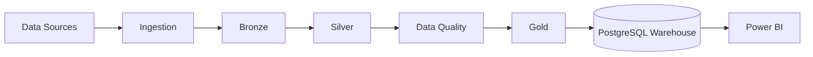
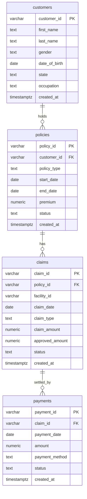

# InsureFlow — Architecture

| | |
|---|---|
| **Status** | Draft v0.1 |
| **Current phase** | Phase 2A — Facility Data Source Acquisition |
| **Short version** | See [`ARCHITECTURE_ESSENTIAL.md`](./ARCHITECTURE_ESSENTIAL.md) |

**Status legend:** **[Implemented]** exists in the repo · **[Planned]** agreed direction, not built · **[Tentative]** idea, may change.

Anything not marked **[Implemented]** must not be described as done in the README or elsewhere.

---

## 1. Purpose

This document describes the target architecture of InsureFlow and how it is expected to evolve. It separates what exists today from what is planned, so agents and readers never confuse the two.

## 2. Target Architecture



| Stage | Purpose | Status |
|---|---|---|
| Data Sources | Synthetic generators, data.gov.my, MOH facility data | Customers generator **[Implemented in Phase 1]**; rest **[Planned]** |
| Ingestion | Load sources into the platform without changing content | **[Planned]** |
| Bronze | Raw, append-only copy plus ingestion metadata | **[Planned]** |
| Silver | Cleaned, typed, deduplicated, conformed | **[Planned]** |
| Data Quality | Rule checks, thresholds, quarantine of bad rows, reports | **[Planned]** |
| Gold | Business-ready dimensional model | **[Planned]** |
| PostgreSQL Warehouse | Serves Gold to BI | Postgres container **[Implemented in Phase 1]**; warehouse modelling **[Planned]** |
| Power BI | Dashboards | **[Planned]** |

Later additions: dbt, Airflow, MinIO (S3-compatible), incremental processing, monitoring, optional Azure/Databricks concepts **[Tentative]**.

## 3. Layer Definitions (contract for future phases)

### Bronze **[Planned]**
- Stores data **as received**; no business logic, no type coercion beyond what the file format forces.
- Adds metadata columns: `_ingested_at`, `_source`, `_batch_id` (names may be refined in the Bronze phase).
- Append-only; reprocessing never mutates history.

### Silver **[Planned]**
- Enforces types, trims/standardises text, handles nulls, removes duplicates.
- Conforms codes (e.g. state names, facility identifiers) across sources.
- Rows failing hard quality rules are quarantined, not silently dropped.

### Data Quality **[Planned]**
- Rule categories: completeness, uniqueness, validity (ranges, allowed values), referential integrity, consistency (e.g. `approved_amount <= claim_amount`).
- Results are persisted and reportable, not just printed.

### Gold **[Planned]**
Dimensional (star) model, tentatively:

| Table | Type | Grain |
|---|---|---|
| `dim_customer` | dimension | one row per customer |
| `dim_policy` | dimension | one row per policy |
| `dim_facility` | dimension | one row per healthcare facility |
| `dim_date` | dimension | one row per calendar day |
| `fact_claims` | fact | one row per claim |
| `fact_payments` | fact | one row per payment |

## 4. Technology Choices

| Concern | Choice | Why | Status |
|---|---|---|---|
| Language | Python 3.12+ | Standard for DE; matches skills being demonstrated | **[Implemented]** |
| Dependency management | `venv` + `requirements.txt` + `requirements-dev.txt` | Simple, universally understood; separates runtime from test/dev dependencies | **[Implemented]** |
| Test framework | `pytest` + `pytest.ini` | Automated property, count, and determinism verification | **[Implemented]** |
| Data manipulation | pandas | Sufficient at this scale | **[Implemented]** |
| Synthetic data | Faker (seeded) + curated lists | Reproducible; curated lists fix Faker's non-Malaysian defaults | **[Implemented]** |
| Config | `python-dotenv` + `.env` | Secrets stay out of code and Git | **[Implemented]** |
| DB driver | `psycopg2-binary` | Standard PostgreSQL driver | **[Implemented]** (dependency only in Phase 1) |
| Database | PostgreSQL 16 (pinned) in Docker Compose (default host port 5433) | Free, realistic warehouse target; avoids default 5432 host collisions | **[Implemented]** |
| Transformations | dbt | Industry-standard SQL transformations and tests | **[Planned]** |
| Orchestration | Airflow | Industry-standard scheduling and dependency management | **[Planned]** |
| Object storage | MinIO | Local S3-compatible storage, transferable to cloud | **[Planned]** |
| BI | Power BI | Requested consumption layer | **[Planned]** |

## 5. Data Model (Phase 1) **[Implemented in Phase 1]**

Phase 1 tables live in the default `public` schema and act as the **source-system model**. Warehouse layering (Bronze/Silver/Gold) will be introduced later; see ADR-006.



### 5.1 Type and constraint conventions

- Money: `NUMERIC(12,2)`. Never `FLOAT`.
- Timestamps: `TIMESTAMPTZ NOT NULL DEFAULT now()` for `created_at`.
- Dates: `DATE`.
- IDs: `VARCHAR` with fixed prefix format (see §6).
- `NOT NULL` on every column that must always exist.
- `CHECK` constraints for enumerated values (`gender`, all `status` columns, types).
- `CHECK (end_date >= start_date)` on `policies`.
- Non-negative `CHECK` constraints: `premium >= 0` on `policies`, `claim_amount >= 0` and `approved_amount >= 0` on `claims`, `amount >= 0` on `payments`.
- `CHECK (approved_amount <= claim_amount)` on `claims`.
- Referential integrity: All foreign keys (`policies.customer_id`, `claims.policy_id`, `payments.claim_id`) enforce `ON DELETE RESTRICT` (see ADR-009) to preserve audit trails.
- Indexes on all foreign-key columns (`idx_policies_customer_id`, `idx_claims_policy_id`, `idx_payments_claim_id`).
- `claims.facility_id` is a plain column in Phase 1. It becomes a reference to the real facility dimension when the healthcare dataset is introduced.

### 5.2 Proposed enumerations (finalise in the SQL script)

| Column | Allowed values (proposed) |
|---|---|
| `customers.gender` | `Male`, `Female` |
| `policies.policy_type` | `MEDICAL`, `HOSPITALIZATION`, `CRITICAL_ILLNESS`, `PERSONAL_ACCIDENT` |
| `policies.status` | `ACTIVE`, `EXPIRED`, `CANCELLED`, `LAPSED` |
| `claims.claim_type` | `OUTPATIENT`, `INPATIENT`, `EMERGENCY`, `DENTAL` |
| `claims.status` | `SUBMITTED`, `APPROVED`, `PARTIALLY_APPROVED`, `REJECTED` |
| `payments.payment_method` | `BANK_TRANSFER`, `CHEQUE`, `CARD`, `E_WALLET` |
| `payments.status` | `PENDING`, `COMPLETED`, `FAILED` |

## 6. Identifier Conventions

| Entity | Format | Example |
|---|---|---|
| Customer | `C` + 6 digits | `C000001` |
| Policy | `P` + 7 digits | `P0000001` |
| Claim | `CL` + 7 digits | `CL0000001` |
| Payment | `PM` + 7 digits | `PM0000001` |

Only the customer format is implemented in Phase 1; the others are the convention for later generators.

## 7. Synthetic Data Design

- **Determinism:** a single fixed seed feeds both `random` and Faker. No field uses wall-clock time. Same seed → byte-identical CSV.
- **Names:** curated first/last-name lists for Malay, Chinese, and Indian communities, sampled with approximate population weights.
- **Occupations:** curated list of ~30 realistic Malaysian occupations.
- **States:** 13 states + 3 Federal Territories (Kuala Lumpur, Putrajaya, Labuan).
- **Age:** 18–65 relative to a fixed reference date (not today's date).
- **Clearly synthetic:** no real individuals; no realistic national ID numbers, phone numbers, or emails in Phase 1.
- **Realism upgrades for later phases:** claim amounts correlated with claim type, seasonality, occasional deliberate defects (nulls, duplicates, out-of-range values) to give the Data Quality phase real work.

## 8. Repository Layout

Project workspace: `C:\Users\User\Projects\insureflow-data-platform` (`insureflow-data-platform`).

```
insureflow-data-platform/
├── README.md
├── AGENTS.md              # rules for any AI coding agent
├── CLAUDE.md              # Claude-specific additions
├── .gitignore
├── .env.example
├── docker-compose.yml
├── requirements.txt
├── requirements-dev.txt   # dev & test dependencies (pytest)
├── pytest.ini             # pytest root configuration
├── data/
│   ├── raw/               # generated/ingested source files (customers.csv tracked)
│   ├── processed/         # future pipeline outputs
│   └── sample/            # small tracked samples
├── src/
│   ├── ingestion/         # future
│   ├── generation/        # synthetic data generators
│   ├── transformation/    # future
│   └── quality/           # future
├── sql/                   # schema and DDL scripts (init.sql)
├── tests/                 # automated test suite (pytest)
├── notebooks/
└── docs/
    ├── PRD.md
    └── architecture/
        ├── ARCHITECTURE.md
        └── ARCHITECTURE_ESSENTIAL.md
```

### Module responsibilities

| Path | Responsibility |
|---|---|
| `src/generation/` | Produce synthetic datasets. Pure data generation; no DB writes in Phase 1. |
| `src/ingestion/` | Move data from sources into Bronze. Empty in Phase 1. |
| `src/transformation/` | Bronze → Silver → Gold logic. Empty in Phase 1. |
| `src/quality/` | Data quality rules and reporting. Empty in Phase 1. |
| `sql/` | Idempotent, from-scratch-runnable DDL (`init.sql`). |
| `tests/` | Automated checks (row count, uniqueness, determinism in Phase 1 via `pytest`). |
| `requirements.txt` | Core runtime dependencies pinned. |
| `requirements-dev.txt` | Dev/test dependencies pinned (`pytest`). |
| `pytest.ini` | Python path configuration for `pytest` root discovery. |

## 9. Configuration and Secrets

- Configuration is read from environment variables, loaded via `python-dotenv`.
- `.env.example` is committed with placeholder values only; `.env` is git-ignored.
- Variables: `POSTGRES_DB`, `POSTGRES_USER`, `POSTGRES_PASSWORD`, `POSTGRES_PORT` (default: `5433`).
- No credentials in code, SQL, Compose files, README, or Git history.

## 10. Docker / PostgreSQL

- Image pinned to a specific major version (`postgres:16-alpine`, no `latest`).
- Container name: `insureflow-postgres`; Compose service: `postgres`.
- Named volume for persistence (`insureflow_postgres_data`).
- `restart: unless-stopped`.
- Health check using `pg_isready`.
- Host port bound to `127.0.0.1:${POSTGRES_PORT:-5433}:5432` (default host port 5433 avoids conflict with host Postgres installations on 5432).
- `sql/` mounted into `/docker-entrypoint-initdb.d/`. Init scripts run **only when the data volume is empty**.
- To recreate from scratch in Windows PowerShell: `docker compose down -v; docker compose up -d` (Bash: `docker compose down -v && docker compose up -d`).

## 11. Data Quality Strategy **[Planned]**

Introduced with Silver. Principles decided now so later work stays consistent:

1. Quality rules are code, versioned in the repo.
2. Failing rows are **quarantined with a reason**, not deleted.
3. Each run produces a persisted quality report.
4. Rules are grouped by type (completeness, uniqueness, validity, referential, consistency).

## 12. Orchestration and Incremental Processing **[Planned]**

- Airflow DAGs will mirror the pipeline stages.
- Incremental loads will be keyed on batch/ingestion metadata added in Bronze.
- Every step must be **idempotent**: re-running a step for the same input yields the same result.

## 13. Security and Privacy

- All personal-looking data is synthetic; no real PII is ever stored.
- Database bound to localhost only.
- Secrets only via environment variables.
- Public datasets (data.gov.my, MOH) are used within their licence terms, which are recorded when acquired.

## 14. Evolution by Phase

| Phase | Architectural change |
|---|---|
| 1 | Repo skeleton, Postgres container, base schema, customer generator |
| 2A | Facility data source acquisition, profiling, and reference proposal |
| 2B | Policy, claim, payment generators; link claims to facilities reference |
| 3 | Ingestion code; Bronze layer with metadata |
| 4 | Silver transformations; DQ framework |
| 5 | Gold dimensional model in Postgres |
| 6 | Power BI connects to Gold |
| 7 | dbt takes over transformations; Airflow orchestrates |
| 8 | MinIO replaces local files as the lake; incremental loads |
| 9 | Monitoring, alerting, CI |
| 10 | Optional Azure/Databricks mapping |

## 15. Architecture Decision Records

| ID | Decision | Rationale | Status |
|---|---|---|---|
| ADR-001 | `venv` + `requirements.txt`, no Poetry/Pipenv | Minimal, universal, enough for this project | Accepted |
| ADR-002 | PostgreSQL in Docker Compose | Realistic, free, reproducible | Accepted |
| ADR-003 | `NUMERIC(12,2)` for money | Avoid floating-point error | Accepted |
| ADR-004 | Deterministic generation via fixed seed, no wall-clock fields | Reproducible datasets and tests | Accepted |
| ADR-005 | Prefixed string IDs (`C000001`) | Human-readable, predictable | Accepted |
| ADR-006 | Phase 1 tables in `public`; warehouse layering decided in Bronze phase | Avoid premature schema design | Open |
| ADR-007 | `facility_id` is a plain column until facility data is introduced | Real dataset arrives later | Accepted |
| ADR-008 | Curated name/occupation lists instead of Faker defaults | Faker defaults are not realistically Malaysian | Accepted |
| ADR-009 | `ON DELETE RESTRICT` on all foreign key constraints | In insurance/financial systems, accidental cascading deletes of parent entities (customers, policies, claims) silently wipe audit trails and violate regulatory/data integrity requirements. Parent records must not be deleted while active child references exist. | Accepted |

## 16. Conventions

- **Python:** functions over monolithic scripts, type hints where useful, docstrings on important functions, no unnecessary abstraction.
- **SQL:** lowercase snake_case identifiers, explicit constraint names, scripts runnable from scratch.
- **Git:** small, focused commits with clear messages; never commit `.env`.
- **Docs:** update `ARCHITECTURE.md` and `ARCHITECTURE_ESSENTIAL.md` in the same change that alters the architecture.
