# InsureFlow — End-to-End Pipeline Architecture Diagram

A clean, left-to-right architectural overview of the InsureFlow medallion data pipeline. This diagram illustrates the flow from external sources through Bronze, Silver, Data Quality quarantine, and Gold star schema layers into the planned analytical BI consumption layer.

```mermaid
flowchart LR
    %% Subgraphs and styling
    classDef sourceStyle fill:#1e293b,stroke:#475569,stroke-width:2px,color:#f8fafc;
    classDef medallionStyle fill:#0f172a,stroke:#3b82f6,stroke-width:2px,color:#f8fafc;
    classDef rejectStyle fill:#450a0a,stroke:#ef4444,stroke-width:2px,color:#fca5a5;
    classDef goldStyle fill:#14532d,stroke:#22c55e,stroke-width:2px,color:#dcfce7;
    classDef plannedStyle fill:#312e81,stroke:#6366f1,stroke-width:2px,stroke-dasharray: 5 5,color:#e0e7ff;

    subgraph S1["1. Raw Sources & Generation"]
        direction TB
        MOH["MoH Malaysia Registry<br/>(5,160 Public Facilities)"]:::sourceStyle
        SYNTH["Deterministic Synthetic Data<br/>(1,000 Customers, 1,379 Policies,<br/>423 Claims, 364 Payments)"]:::sourceStyle
    end

    subgraph S2["2. Bronze Layer (bronze.*)"]
        direction TB
        INGEST["COPY Ingestion Engine<br/>(Idempotent, SHA-256 Hashing)"]:::medallionStyle
        BRZ[("Bronze Tables<br/>Raw TEXT Storage +<br/>_batch_id & _ingested_at")]:::medallionStyle
        INGEST --> BRZ
    end

    subgraph S3["3. Silver Layer (silver.*)"]
        direction TB
        TRANS["Silver Transformation<br/>(Type Casting, FK Validation)"]:::medallionStyle
        SLV[("Silver Tables<br/>Typed & Constrained<br/>8,326 Validated Rows")]:::medallionStyle
        REJ[("silver.rejected_rows<br/>Corrupt / Orphan Records<br/>Isolated with Reason")]:::rejectStyle
        TRANS --> SLV
        TRANS -.->|Invalid / Orphan| REJ
    end

    subgraph S4["4. Data Quality Engine"]
        direction TB
        DQ["DQ Rule Framework<br/>(35 Rules, 100% Recall on<br/>188 Injected Defects)"]:::medallionStyle
        QUAR[("Quarantine Storage<br/>data/sample/*_quarantine.csv")]:::rejectStyle
        DQ -.->|Failing Rows| QUAR
    end

    subgraph S5["5. Gold Layer (gold.*)"]
        direction TB
        LOAD["Atomic Full-Refresh<br/>(Transactional Truncate & Load)"]:::goldStyle
        GLD[("Gold Star Schema<br/>4 Dimensions + 2 Facts<br/>74.28% Loss Ratio")]:::goldStyle
        LOAD --> GLD
    end

    subgraph S6["6. Analytics & BI"]
        PBI["Power BI Dashboards<br/>(Loss Ratio, Geographic &<br/>Claims Insights)<br/>[Planned]"]:::plannedStyle
    end

    %% Pipeline flow connections
    MOH --> INGEST
    SYNTH --> INGEST
    BRZ --> TRANS
    SLV --> DQ
    SLV --> LOAD
    GLD -.-> PBI
```

### Stage Summary & Key Facts

| Stage | Key Real Fact | Technology / Artifact |
|---|---|---|
| **Raw Sources** | 5,160 authentic MoH facilities + 1,000 synthetic customers, 1,379 policies, 423 claims, 364 payments | `data/raw/*.csv`, Python generators |
| **Bronze Layer** | Idempotent bulk COPY loading with SHA-256 skip checks and metadata tracking (`_batch_id`, `_ingested_at`) | `bronze.*`, `src/ingestion/ingest_bronze.py` |
| **Silver Layer** | Strong typing (`DATE`, `NUMERIC(12,2)`), `CHECK` constraints, Python FK checks; bad data routed to `rejected_rows` | `silver.*`, `src/transformation/transform_silver.py` |
| **Data Quality** | 35 rules across 4 dimensions; detected 188 of 188 injected defects (100% recall); 0 failures on clean baseline | `src/quality/run_dq_checks.py`, `data/sample/` |
| **Gold Layer** | Star schema with 4 dimensions and 2 facts; denormalized `customer_id` on claims; 74.28% loss ratio matching Silver | `gold.*`, `src/transformation/load_gold.py` |
| **Power BI (Planned)** | Executive portfolio health, claims geospatial analysis, loss ratio drilldowns | *Phase 6 Planned Deliverable* |
